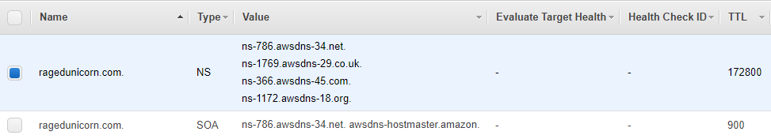
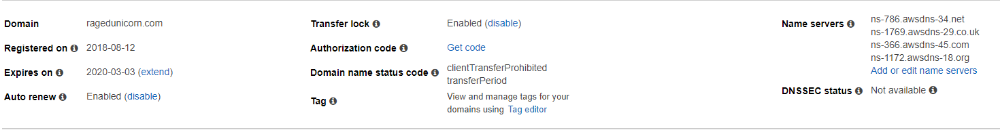

# ragedunicorn-base

> Module for ragedunicorn-base

This module is intended to create base resources for use within the RagedUnicorn organization. This includes basic roles and users that don't belong to a specific application or project or other aws resources.


## Inputs

| Name       | Description        | Type   | Default        | Required |
|------------|--------------------|--------|----------------|----------|
| access_key | The AWS access key | string | -              | yes      |
| aws_region | AWS region         | string | `eu-central-1` | no       |
| secret_key | The AWS secret key | string | -              | yes      |


## Outputs

| Name                        | Description                                      |
|-----------------------------|--------------------------------------------------|
| gateway_push_logs_role_arn  | The arn name of the Api Gateway push logs role   |
| gateway_push_logs_role_name | The name of the Api Gateway push logs role       |
| dns_name_servers            | The list of DNS name servers for the Hosted Zone |

## Creates

### Route 53 RagedUnicorn Domain

`route53_main`

Module creates the basic zone entry for the `ragedunicorn.com` domain.

After the zone is created the nameservers need to be updated for the domain. The created zone will have an NS entry with the automatically assigned nameservers.



Those entries need to be assigned to the domain `ragedunicorn.com`.

`DOMAINS > Registered domains > (Click) ragedunicorn.com domain`



All the way to the right the nameservers can be edited. Delete potentially already present entries and put all 4 new entries in.

##### Test DNS Resolution

To test if the update of the nameservers worked a tool like whois can be used.

It can be downloaded directly from the Microsoft page: [WHOIS](https://docs.microsoft.com/de-de/sysinternals/downloads/whois)

```
whois ragedunicorn.com
```

This should return the 4 configured nameservers. If the returned nameservers are different from the ones configured in the previous step the update is not yet finished. It can take up to 48h for such an update to happen.

One can also test with nslookup whether the name can be resolved or not.

```
nslookup ragedunicorn.com
```

The returned address in this case will be the address of the nameserver that resolved the dns query.

##### A Recordsets

Once the nameservers are set projects can add their required A record set entries to the hosted zone.

```hcl
data "aws_route53_zone" "main_zone" {
  name         = "ragedunicorn.com."
  private_zone = false
}

resource "aws_route53_record" "dns" {
  zone_id = "${data.aws_route53_zone.main_zone.zone_id}"
  name    = "[name]"
  type    = "A"
  ttl     = "300"
  records = ["${aws_eip.elastic_ip.public_ip}"]
}
```

In the first block the created zone is retrieved and used in the second block to attach the new record. Additionally an Elastic IP is used for the entry. Without an EIP the record does not make much sense because the IP might change quite often. As an example an EC2 instance that is stopped and restarted usually already gets a new IP address.

Again it can take some time before the new record set is propagated and actually works. This can be tested with nslookup.

```
nslookup [name].ragedunicorn.com
```

This should return one or more IP addresses depending on how it was setup.

### Api Gateway Push Logs Role

`iam_api_gateway_logs`

Module creates a basic IAM role that allows Api Gateway to push logs to CloudWatch. The module will print the arn of the created role when finished.
This arn has to be manually setup inside Api Gateway settings.

[Settings](https://eu-central-1.console.aws.amazon.com/apigateway/home?region=eu-central-1#/settings)

Subsequently logging capabilities can then be activated for Gateway APIs.
