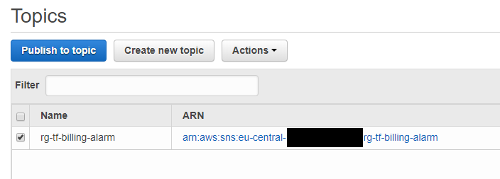
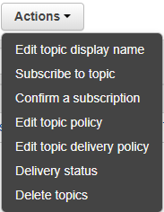
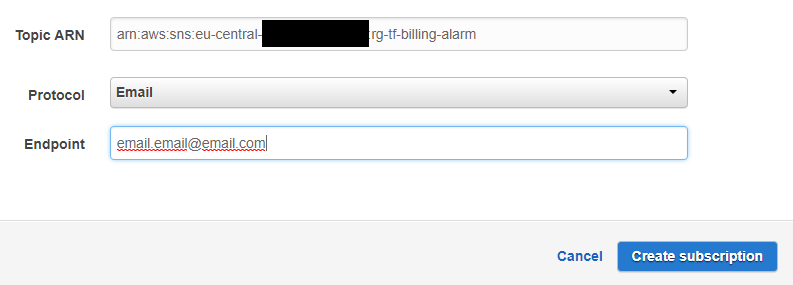

# ragedunicorn-budget

> Module for ragedunicorn-budget

A module for creating budgets and alarms in AWS.

## Inputs

| Name           | Description                 | Type   | Default        | Required |
|----------------|-----------------------------|--------|----------------|----------|
| access_key     | The AWS access key          | string | -              | yes      |
| aws_region     | AWS region                  | string | `eu-central-1` | no       |
| linked_account | Linked account for alarming | string | -              | yes      |
| secret_key     | The AWS secret key          | string | -              | yes      |

## Outputs

| Name                          | Description                |
|-------------------------------|----------------------------|
| budget_total_id               | Id of the created resource |
| budget_ec2_id                 | Id of the created resource |
| budget_lambda_id              | Id of the created resource |
| budget_storage_id             | Id of the created resource |
| budget_cloudwatch_id          | Id of the created resource |
| account_billing_alarm_high_id | Id of the created resource |
| account_billing_alarm_mid_id  | Id of the created resource |
| billing_alarm_topic_arn       | The ARN of the SNS topic   |

## Subscription to SNS

Terraform currently does not allow automatic subscription for certain types such as E-Mail. See [documentation](https://www.terraform.io/docs/providers/aws/r/sns_topic_subscription.html#email) for more infos.

A subscription can however be added manually with ui interface (or cli).

###### Step 1

Go to AWS SNS console and choose the topic to subscribe to.

###### Step 2

Choose "Subscribe to topic" from the actions dropdown.

###### Step 3

Choose the protocol to subscribe to (in this case E-Mail) and create the subscription.

Afterwards the registered E-Mail address will receive an E-Mail to confirm its subscription.

**Note:** These steps need to be repeated if the SNS topic is deleted and recreated for some reason.
