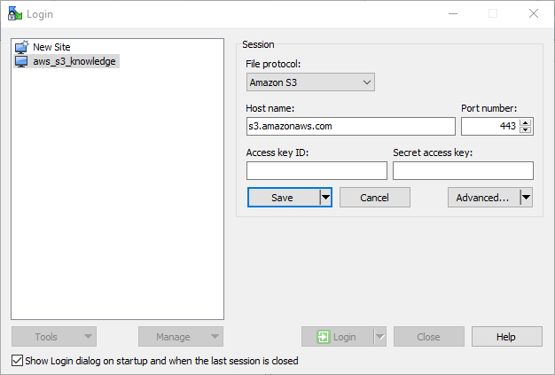
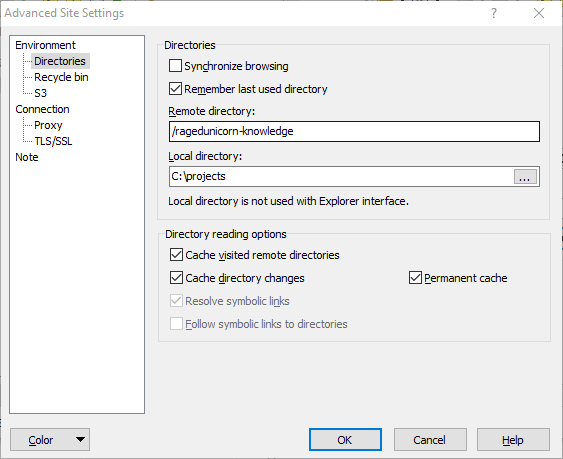

# ragedunicorn-knowledge

> Module for the knowledge project

Creates a bucket that is intended to contain all relevant data to learning and documenting data. Mostly containing data for tools such as Confluence and Obsidian.

## Inputs

| Name       | Description        | Type   | Default        | Required |
|------------|--------------------|--------|----------------|----------|
| access_key | The AWS access key | string | -              | yes      |
| aws_region | AWS region         | string | `eu-central-1` | no       |
| secret_key | The AWS secret key | string | -              | yes      |

## Outputs

| Name               | Description                            |
| ------------------ | -------------------------------------- |
| arn                | The ARN of the bucket                  |
| bucket_domain_name | The bucket domain name                 |
| iam_access_key     | The AWS access key.                    |
| iam_arn            | The ARN assigned by AWS for this user. |
| iam_name           | The user's name.                       |
| iam_secret_key     | The AWS secret key.                    |
| iam_unique_id      | The unique ID assigned by AWS.         |
| id                 | Id of the created bucket               |
| region             | The AWS region this bucket resides in  |

## WinSCP Connect

IAM policy for bucket:

```hcl

data "aws_iam_policy_document" "s3_policy_document" {
  statement {
    actions = [
      "s3:ListBucket",
    ]
    resources = [
      "arn:aws:s3:::ragedunicorn-knowledge",
    ]
  }

  statement {
    actions = [
      "s3:*",
    ]
    resources = [
      "arn:aws:s3:::ragedunicorn-knowledge/*",
    ]
  }
}

```

The IAM policy allows listing of only the exact bucket in the first statement. In the second statement all actions are allowed inside said bucket. Because of this it is important in WinSCP to connect directly to the proper bucket because the user will not have the rights to list other buckets.

#### Step 1
Choose Advanced Settings



#### Step 2

